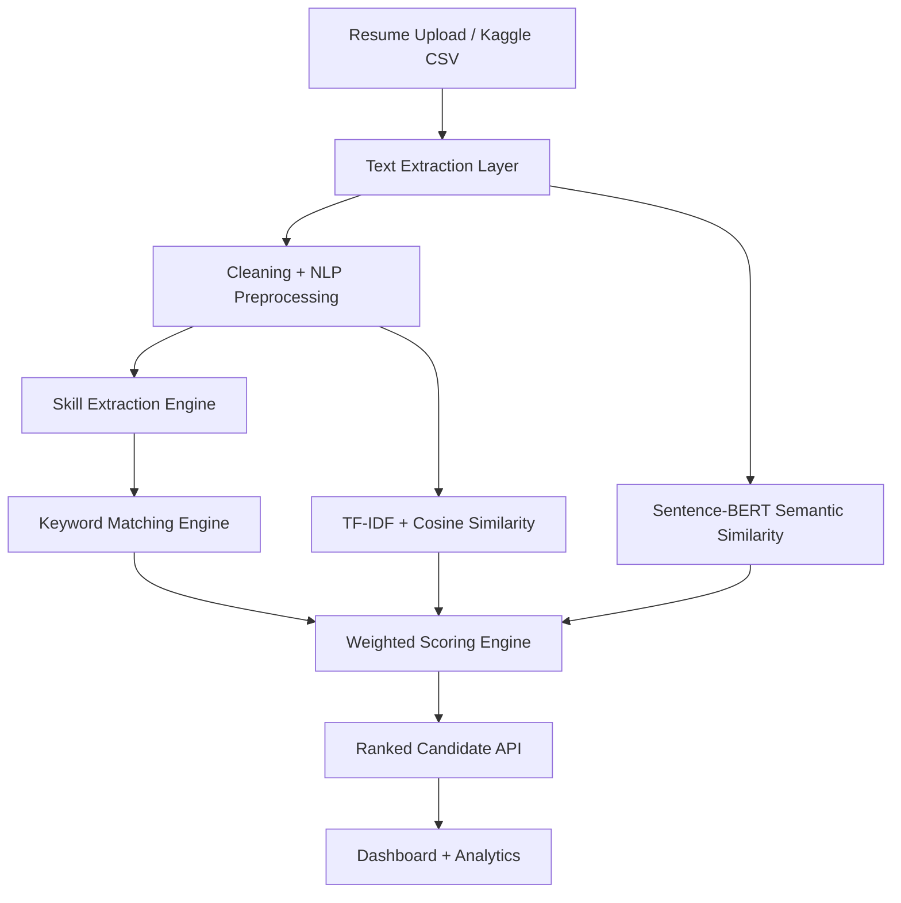

# AI-Powered Resume Screening & Ranking System

Production-style resume screening app using FastAPI, React, NLP preprocessing, skill extraction, TF-IDF, cosine similarity, and Sentence-BERT semantic matching.

## Features

- PDF, DOCX, TXT resume parsing
- Kaggle CSV importer for the Snehaan Bhawal Resume Dataset
- Bias-aware preprocessing that removes common name, gender, contact, and location signals before scoring
- Rule-based skills, lightweight NER hooks, ontology normalization, and context-aware matching
- Weighted score: skills 40%, experience 25%, education 15%, certifications 10%, semantic similarity 10%
- TF-IDF keyword relevance, cosine similarity, and Sentence-BERT embeddings
- React dashboard with ranked candidates, missing skills, score bands, and top skill analytics
- Docker Compose stack with FastAPI, Postgres, Redis, and React

## Architecture



## Run Locally

Backend:

```bash
cd backend
python -m venv .venv
.venv\Scripts\activate
pip install -r requirements.txt
python -m spacy download en_core_web_sm
uvicorn app.main:app --reload
```

Frontend:

```bash
cd frontend
npm install
npm run dev
```

Docker:

```bash
docker compose up --build
```

Open `http://localhost:5173` and use **Run sample** or upload PDF/DOCX/TXT resumes.

## API Endpoints

- `GET /api/health` returns service health.
- `POST /api/rank` ranks JSON resume text payloads.
- `POST /api/rank/files` accepts multipart PDF/DOCX/TXT resumes.
- `POST /api/rank/kaggle-csv?csv_path=...&limit=500` ranks rows from the Kaggle CSV.

Example JSON:

```json
{
  "job": {
    "title": "Senior NLP Engineer",
    "description": "Python, FastAPI, spaCy, transformers, PostgreSQL, Docker, AWS, and 5+ years ML experience.",
    "required_skills": ["python", "spacy", "fastapi", "transformers", "postgresql"],
    "preferred_skills": ["docker", "aws", "nlp"],
    "min_experience_years": 5,
    "education_keywords": ["computer science", "engineering"],
    "certification_keywords": ["aws certified"]
  },
  "resumes": [
    {
      "candidate_id": "candidate-a",
      "text": "Senior ML engineer with 6 years of experience using Python, FastAPI, spaCy, transformers, PostgreSQL, Docker and AWS."
    }
  ]
}
```

## Dataset

Use the Kaggle dataset at `https://www.kaggle.com/datasets/snehaanbhawal/resume-dataset`. Public mirrors describe it as resume records with fields such as `ID`, `Resume_str`, `Resume_html`, and category labels. Place the downloaded CSV in `backend/data/` and call the Kaggle CSV endpoint with that local path.

The importer is intentionally tolerant: it detects common resume text, HTML, ID, and category column names so the code keeps working if the downloaded file has minor naming differences.

## Model Choices

The ranking model uses a hybrid approach instead of depending on one algorithm. Resume screening needs exact matching for hard skills, but it also needs semantic matching when candidates describe the same experience in different words.

- TF-IDF highlights important job and resume terms without giving too much weight to common words.
- Cosine similarity compares resumes and job descriptions fairly, even when document lengths are different.
- Sentence-BERT adds meaning-based comparison, such as matching "embedding retrieval" with "semantic search".
- spaCy keeps preprocessing fast and reliable for tokenization, lemmatization, and sentence handling.
- The weighted scoring layer keeps the final result explainable by separating skills, experience, education, certifications, and semantic relevance.

Full model explanation is available in `docs/TECHNICAL_DOCUMENTATION.md`.

## Evaluation

Recommended metrics:

- Accuracy for classification-style labels such as fit/no-fit.
- Precision for how many recommended candidates are truly relevant.
- Recall for how many relevant candidates the system finds.
- F1-score to balance precision and recall.
- Semantic similarity score for embedding-level relevance.
- Ranking efficiency using latency per resume and NDCG or MAP when judged rankings are available.

## Deployment

- Render or Railway: deploy `backend` as a Python web service and `frontend` as a static/Vite app.
- AWS: run containers on ECS/Fargate, use RDS Postgres, ElastiCache Redis, and S3 for resume storage.
- For production, store uploaded files in object storage, keep extracted text in Postgres, and cache embeddings by resume hash.

## Notes

This project ranks technical relevance. It intentionally avoids using candidate names, gendered words, phone/email details, or location hints as scoring evidence.
